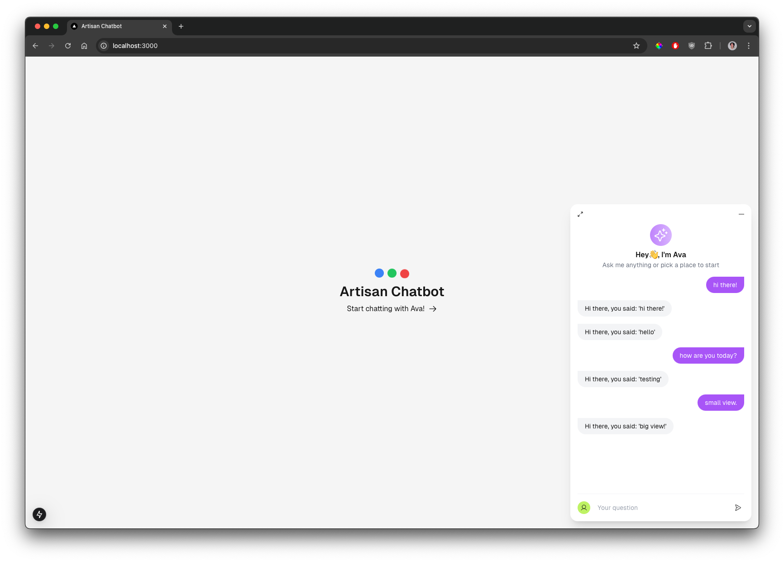

# Artisan Chatbot Project Overview



This project consists of two main parts:

1. **Backend:** FastAPI (located in the `backend/` directory)
2. **Frontend:** Next.js (located in the `frontend/` directory)

## Getting Started

Clone this repo:

```bash
gh repo clone plumsily/artisan-chatbot
```

### Backend (FastAPI)

To get the backend (FastAPI) up and running, follow these steps:

1. Navigate to the `backend/` directory:

    ```bash
    cd backend
    ```

2. **Create a virtual environment** (if not already created):

    ```bash
    python -m venv .venv
    ```

3. **Activate the virtual environment:**

    ```bash
    source .venv/bin/activate
    ```

4. **Install the required dependencies:**

    ```bash
    pip install -r requirements.txt
    ```

5. **Run the development server:**

    ```bash
    fastapi dev app/main.py
    ```

### Frontend (Next.js)

To get the frontend (Next.js) up and running, follow these steps:

1. Navigate to the `frontend/` directory:

    ```bash
    cd frontend
    ```

2. **Install the dependencies:**

    ```bash
    npm install
    ```

3. **Run the development server:**

    ```bash
    npm run dev
    ```

4. Open your browser and navigate to `http://localhost:3000` to view the Next.js app.

---

## Additional Information

- The FastAPI backend should be running on a different port (`http://localhost:8000`).
- Ensure both the frontend and backend servers are running simultaneously.


## Development Steps

### Backend Development

1. **Create Models**

   - Designed initial models for storing messages and agent responses.

2. **Set Up API Routes**

   - Developed API endpoints for creating, retrieving, updating, and deleting messages.
   - Developed handlers to auto generate agent responses on user submission.

3. **In-Memory Testing**

   - Used temporary in-memory storage for early testing of endpoints.
   - Verified each route using curl commands to test and validate responses.

4. **Add SQLite Database for Persistence**

   - After validating functionality and frontend integration, integrated SQLite as a persistent database.
   - Updated models and endpoints to support SQLite, ensuring data is retained across sessions.

5. **Pytest and GitHub Actions CI**

   - Create api test using pytest to ensure API endpoints function as expected.
   - Configured GitHub Actions to run these tests automatically in CI to automate the testing process.

### Frontend Development

1. **Initial Component Layout**

   - Identified the core components necessary to interact with backend API endpoints.
   - Created components to display messages and accept user input.

2. **Modularize and Design Components**

   - Broke down components into smaller, reusable parts.
   - Focused on modular design, separating concerns across components for better maintainability.

3. **Design and Responsive Enhancements**

   - Improved design with user-friendly elements and responsive features.
   - Added non-critical features, like chat window expansion and button animations, to enhance the user experience without impacting functionality.

4. **Linking Backend and Frontend**

   - Throughout frontend development, API routes were built out or updated to handle message exchanges.
   - Verified end-to-end functionality by testing agent responses and ensuring real-time message updates.


## Future Considerations

- **Frontend Integration Tests:**
  - Plan to write integration tests for the frontend using Jest.

- **Performance Optimizations:**
  - Explore large list memoization techniques to enhance performance.

